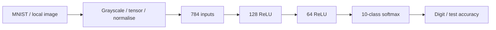

# MNIST Neural Network Classifier

A PyTorch feedforward neural network for handwritten digit classification, built for UCT CSC3022 in 2024.

## Overview

Recognise digits 0-9 from 28 x 28 grayscale images. The original project loads MNIST, trains a fully connected network, evaluates it against the MNIST test split and accepts a local image for prediction.

## Technical Approach

Flatten 784 pixels, apply 128- and 64-unit hidden layers with ReLU, then a 10-class softmax. Training uses Adam (learning rate 0.001), batches of 32 and seven epochs. Images are converted to grayscale and normalised using mean/std 0.5.

The submission applies softmax before `CrossEntropyLoss`. PyTorch expects logits for this loss; the historical implementation is retained so its recorded result is not attributed to a different model. A future logits-only revision should be evaluated separately.

## Tech Stack

Python 3.11 recommended; PyTorch, torchvision, Pillow. The original submission specified Python 3 without an exact minor version. Dependency ranges are cleanup requirements, not a recovered historical environment.

## Key Features

- MNIST loading and minibatch training.
- Full test-split accuracy calculation.
- Local image resizing and digit prediction.
- Import-safe execution and optional bounded smoke run.

## Architecture / Pipeline



## Results

The original `results/original-training.log` records **95.71% test accuracy**. This is a historical submission result, not a fresh reproduction or cross-validation score. Dataset: MNIST's standard training and test splits. The project does not provide a saved trained checkpoint or seeded repeatability evidence.

Limitations include the softmax/loss mismatch, no fixed training seed, retraining on each launch, limited robustness to photos and handwriting outside MNIST, and no per-class evaluation in the submission.

## Running the Project

```sh
python -m venv .venv
# Windows PowerShell: .\.venv\Scripts\Activate.ps1
# Linux/macOS: source .venv/bin/activate
python -m pip install -r requirements.txt
python classifier.py --download
```

Subsequent runs use `data/` without a download. For a quick execution check:

```sh
python classifier.py --download --epochs 1 --train-limit 128 --test-limit 64 --no-interactive
```

This subset result is not a benchmark. To use a pre-existing MNIST cache, pass `--data-dir PATH`. Enter a path to your own digit image at the prompt, or `exit`. The original local sample is excluded because its origin is unconfirmed.

## Project Structure

`classifier.py`: model/training/prediction; `results/`: original training log; `requirements.txt`: cleanup dependencies. Dataset caches and the unverified sample image are excluded. MNIST is obtained through torchvision from its published download sources; no dataset copy is redistributed here.

## What I Learned

Implementing a neural network in PyTorch, normalising image input, training with minibatches and evaluating classification accuracy. The retained limitations provide concrete opportunities to improve experimental rigour.

## Possible Improvements

Use logits with cross entropy; seed experiments; save model checkpoints; add confusion matrices and robustness tests; evaluate a CNN as a separate extension.

## Portfolio Enhancements

The original classifier retains its historical softmax/output convention. `experiments.py` adds a separate logits-based comparison, fixes import-time model/optimizer allocation, records losses/confusion matrices and produces real held-out prediction/failure examples.

```sh
python experiments.py --data-dir data --download
```

The committed report uses seed42, 10,000 training examples, 2,000 disjoint validation examples, 2,000 fixed official test examples, Adam0.001 and three epochs. Test subsets use seed66. Results: original softmax/batch32 89.8%; logits/batch32 91.3%; logits/batch128 90.1%. These new subset experiments do not reproduce or replace the original full-data95.71% result. Cross-entropy losses differ by output convention; timings include validation and are machine-specific. No test-driven tuning was performed.

`results/enhancement/experiments.json` contains actual epoch-level losses, validation accuracy and all test confusion counts. `predictions.webp` shows the first four correct and first four wrong logits/batch32 predictions in fixed test order. Dataset caches remain excluded. More seeds, saved checkpoints and an independent CNN baseline remain future work.

## Portfolio Cleanup / Post-project Improvements

Dataset creation and training moved into the entry point; configurable data directory, smoke limits and non-interactive mode added; missing `ImageFilter` import fixed. Original architecture, training default and historical result retained. The original files remain outside this clean copy.
