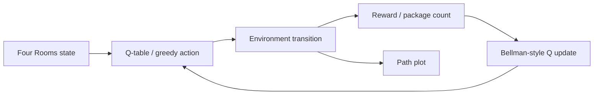

# Four Rooms Reinforcement Learning

Tabular Q-learning experiments for package collection in the Four Rooms environment, UCT CSC3022, 2024.

## Overview

An agent moves through connected rooms to collect one package, several packages or an ordered sequence. Three submitted scripts explore deterministic and stochastic transitions. The environment is teaching code supplied with the coursework; the scenario implementations are the submitted project work.

## Technical Approach

Store state-action values in NumPy Q-tables and update them using learning rate, discount factor and shaped rewards. Actions are chosen with `argmax`; the scripts do not implement an epsilon-greedy exploration policy. The supplied environment can redirect an action with 20% probability in stochastic mode. Scenarios 2/3 include remaining package count in the table indexing.

## Tech Stack

Python 3.11 recommended; NumPy, Matplotlib. Historical Python minor version is unknown.

## Key Features

- Single-package, multiple-package and ordered-collection scenarios.
- Deterministic/stochastic action modes.
- Historical path plots from the submission.
- Timeout launcher for safe local exploration.

## Architecture / Pipeline



## Results

`results/original/` contains six supplied path images. They show recorded trajectories; they do not establish a success rate or an optimal policy. No fabricated reward/accuracy metrics are reported.


Important limitations in the preserved algorithms: inconsistent position/package bookkeeping, terminal bootstrapping, unbounded inner/evaluation loops and a coarse state representation that does not encode all collected-package histories. A deterministic run can stall. The environment is 13 x 13 including borders, while submitted indexing uses a stride of 12; only interior coordinates are visited. These details should be corrected and benchmarked in a separately labelled algorithm revision.

## Running the Project

```sh
python -m venv .venv
# Windows PowerShell: .\.venv\Scripts\Activate.ps1
# Linux/macOS: source .venv/bin/activate
python -m pip install -r requirements.txt
python run_scenario.py 1 --timeout 30
python run_scenario.py 2 --stochastic --timeout 30
python run_scenario.py 3 --stochastic --timeout 30
```

Images produced by new runs go to `generated/`. Exit 124 means timeout, not successful completion. The direct `Scenario*.py` scripts retain the submitted behaviour; use the bounded launcher for verification.

## Project Structure

`FourRooms.py`: supplied environment; `Scenario1.py`-`Scenario3.py`: submitted agents; `run_scenario.py`: cleanup launcher; `results/original/`: historical paths.

## What I Learned

Representing reinforcement-learning state, defining rewards, implementing Q-value updates and understanding how stochastic transitions and bookkeeping affect learning.

## Possible Improvements

Fix state bookkeeping and terminal updates, add epsilon-greedy exploration, explicit episode limits, seeds and success/return statistics across repeated runs. These would be post-project improvements rather than original coursework results.

## Portfolio Cleanup / Post-project Improvements

Added setup instructions, dependency ranges, a timeout wrapper and separate output directory. Submitted algorithms and original plots preserved. Redistribution rights for supplied teaching code must be confirmed before a public repository is created.
