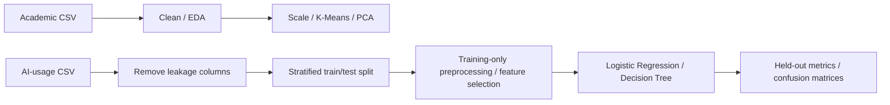

# Student Performance Data Mining

Python analysis combining student segmentation and supervised pass/fail classification, Eduvos ITDAA4, 2026.

## Overview

Explore academic performance and tutorial attendance, segment students by workload/performance, and compare classification models on a separate AI-usage/performance dataset. The notebook also includes SQL reporting queries. Correlation is not treated as proof that tutorials or AI use cause outcomes.

## Technical Approach

Clean inconsistent categorical labels and missing values. Scale eight academic/engagement features; compare K-Means for k=2 through 8 using inertia and silhouette scores; select two clusters and visualise them with two-component PCA.

Classification uses `passed` as the target on 8,000 supplied records. Remove `student_id`, `final_score` and `performance_category` before modelling to avoid identifiers and direct outcome leakage. Use a stratified 80/20 split (`random_state=42`), train-only median/mode imputation and one-hot encoding inside scikit-learn pipelines. Logistic Regression scales numeric features; both models use `SelectKBest(f_classif, k=15)`. Compare Logistic Regression (`max_iter=1000`) with a Decision Tree (`max_depth=5`, `random_state=42`).

## Tech Stack

Python 3.11 recommended; pandas, NumPy, scikit-learn, Matplotlib, IPython/Jupyter and SQL examples. The recommended environment is a cleanup choice; the historical environment is not pinned.

## Key Features

- Data quality checks and exploratory plots.
- K-Means model comparison and PCA visualisation.
- Pipeline-based supervised preprocessing and feature selection.
- Accuracy, precision, recall, F1 and confusion matrices.
- SQL aggregation/reporting examples.

## Architecture / Pipeline



## Results

The supplied executed notebook records these rounded held-out results:

| Model | Accuracy | Precision | Recall | F1 |
| --- | --- | --- | --- | --- |
| Logistic Regression | 0.948 | 0.965 | 0.976 | 0.971 |
| Decision Tree | 0.928 | 0.949 | 0.972 | 0.960 |

These are historical notebook outputs, not independent cross-validation or deployment results. `passed=1` is the positive class, so the reported recall/F1 concern students who passed; they do not directly measure detection of students needing support. Class imbalance makes accuracy alone insufficient. Dataset provenance, representativeness and availability of predictors before final assessment need review. The academic dataset has 1,348 supplied rows; missing-value treatment before clustering is descriptive rather than a predictive validation scheme.

Fresh local execution on 2026-10-05 reproduced Logistic Regression accuracy **0.9475** and Decision Tree accuracy **0.928125**, matching the rounded original results. Confusion matrices (rows actual, columns predicted; class order 0/1) were `[[127, 50], [34, 1389]]` and `[[102, 75], [40, 1383]]`. This verifies notebook execution, not generalisation beyond the supplied dataset.

## Running the Project

```sh
python -m venv .venv
# Windows PowerShell: .\.venv\Scripts\Activate.ps1
# Linux/macOS: source .venv/bin/activate
python -m pip install -r requirements.txt
jupyter lab
```

Open `notebooks/student-performance.ipynb`. Place authorised copies of `student_performance.csv` and `ai_impact_student_performance_dataset.csv` beside the notebook, then Run All. Those files are ignored. They are held outside the publication tree because origin/licence/anonymisation have not been established. No substitute dataset is invented.

## Project Structure

`notebooks/student-performance.ipynb`: curated submission source, outputs cleared; `requirements.txt`: recommended dependencies; `PUBLISHABILITY.md`: dataset/review status. The local refresh workspace holds private verification data separately.

## What I Learned

Cleaning data, separating descriptive segmentation from predictive classification, fitting preprocessing only on training data, comparing models and interpreting class-sensitive metrics.

## Possible Improvements

Publish dataset provenance when authorised; use repeated stratified cross-validation, a majority-class baseline and metrics for the not-passed class; audit feature availability and fairness; package the pipeline for reproducible experiments.

## Portfolio Cleanup / Post-project Improvements

Renamed the notebook; removed output tables, execution counts and private metadata; preserved code/analysis cells. Duplicate draft/export files and datasets excluded. Original results are described explicitly as historical evidence.
